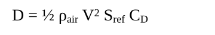

# 2025-11-29 — Fractional Health + Crew Infrastructure

### Highlights
- Health/damage has been fully converted to floats so every system (projectiles, wear, HUD, persistence) can track fractional damage like 0.05 per shot without rounding away durability. JSON snapshots still store float precision; display/UI code rounds to user-friendly values.
- Established the first pass of the crew system: reusable `CrewMember` + `CrewStation` components, a global `CrewManager`, and `CrewPersistenceManager` that writes/loads crew roster + assignments to `Assets/Resources/CrewPersistence.json`.
- Weapon mounts, engines, and lift devices now check for assigned crew before operating, so future crew UIs just need to move people between stations to enable/disable subsystems.

### Code Changes
- **Health.cs + dependents**
  - `currentHealth`, `maxHealth`, `TakeDamage/Heal/SetHealth` now use `float`. All damage sources (`Projectile`, `CannonBall`, `SimpleShrapnel`, `CannonSelfDamage`, `LiftDevice`, `Engine`, `JetEngine`, `AntiGravityDevice`, etc.) pass floats, and HUD listeners (`ShipComponent`, `HUDController`, `ShipHUDDisplay`) subscribe to the float UnityEvent.
  - Persistence (`WeaponPersistenceManager`) clamps/serializes floats, rounding to two decimals when saving so files stay readable.
- **Crew system (new)**
  - `Assets/Scripts/Crew/` now contains `CrewRole`, `CrewMember`, `CrewStation`, and `CrewManager`. Stations declare required specialization + min/max crew; crew auto-registers, keeps Health attached, and remembers pending assignment IDs for later binding.
  - `Assets/Scripts/Systems/CrewPersistenceManager.cs` saves crew stats/health/assignment IDs on a timer (same pattern as weapon persistence) and restores them at boot. Initial resource lives at `Assets/Resources/CrewPersistence.json`.
  - Weapon mounts, `Engine`, and `LiftDevice` gained crew requirement fields. They auto-create a `CrewStation` if the designer hasn’t authored one yet, and all runtime logic early-outs when the assigned station lacks minimum crew.

### Workflow Notes
- To author a crew member: drop `CrewMember` on a character/icon prefab, set ratings (1-10), assign a `Health`, and optionally set `initialStationId` so they spawn at the correct station. The manager will generate a GUID if `crewId` is blank.
- To author a station (either standalone or attached to a subsystem): add `CrewStation`, give it a unique `stationId`, choose required role + headcount. Systems with `autoCreateCrewStation` true will do this automatically, but designers should eventually create explicit mount-point GameObjects and uncheck the auto-create flag.
- Crew persistence is independent from weapon persistence; both managers live under `DontDestroyOnLoad`. Delete the JSON file to reset the roster between tests.
- For float health displays, format values (`{value:F1}` or percentages) before presenting to players. The raw numbers in JSON (e.g., 14.6999998) are expected due to IEEE-754 precision; the runtime clamps/rounds when saving.

### Next Steps
1. Build the HUD crew roster (show `CrewManager.GetUnassignedCrew()`), allow dragging crew onto mount/engine/lift stations, and show station requirements.
2. Link crew ratings to gameplay: e.g., map Gunnery to `ProjectileLauncher.angleSpreadDegrees`, Drive Engineering to engine damage mitigation, Lift Engineering to lift wear.
3. Add failure/death handling (crew health zero) plus redundancy logic for stations that allow backup crew.

# 2025-11-29 — Ship HUD Autopop Refresh

### Highlights
- Ship HUD authoring now follows a strict naming contract (`Ship/<X>_weapon_mount/Weapon_mount` ↔ `HUD/ShipRepresentation/ShipOutline/<X>_weapon_mount`) and the runtime automatically rebinds every reference when icons duplicate or get enabled.
- All per-icon UI affordances (ready lights, target acquisition overlay, health bar, FIRE button) configure themselves based solely on canonical child names, eliminating hand wiring when designers duplicate mounts.
- Documentation updated to teach the new workflow, emphasize duplication as the core path, and enumerate every reference (even autopopulated ones) for future customization.

### Code Changes
- **ShipHUDMountDisplay.cs**
  - Added `AutoAssignAllReferences()` and now call it from `Reset`, `OnValidate`, `Awake`, and `OnEnable` so duplicated HUD icons rebind when entering Play Mode or when a prefab activates.
  - `AutoAssignWeaponMount()` now verifies the cached mount still belongs to the HUD node’s `<X>_weapon_mount` parent before reusing it; if not, it re-resolves the `Ship/<X>_weapon_mount/Weapon_mount` path.
  - Icon child lookups now scan descendants so artists can keep helper GameObjects; ready indicator defaults to the green stoplight sprite, hides the redundant red sprite object, and target indicators/health bars/fire buttons all auto-fill if their canonical children exist.
- **ShipHUDDisplay.cs**
  - Auto-populated `mountDisplays` rescan the hierarchy whenever the discovered list changes, so new `ShipHUDMountDisplay` components begin updating immediately without reassigning arrays in the inspector.

### Documentation
- **Docs/Add Weapon Mounts Instructions.md** now opens with an autopop workflow cheat sheet, clarifies the exact ship + HUD hierarchies, and repeatedly stresses that duplicating `<X>_weapon_mount` nodes is the intended workflow.
- Added glossaries for both `WeaponMount` and `ShipHUDMountDisplay` fields (including autopop behaviors), refreshed the reference table with “Default Source” + “Autopop Notes”, and documented where `ShipRepresentation/ShipOutline/<X>_weapon_mount` lives for HUD authors.

### QA / Notes
- Verified Bow and duplicated Aft mounts both fire, update ready lights, hide target indicators, and wire FIRE buttons without touch-up after duplication.
- Target indicator + health bar defaults now stay enabled automatically unless the developer explicitly replaces the child objects.

## 2025-11-28 — Weapon Mount Workflow + Fire Controls

### Highlights
- Two-mount flow works end-to-end: both bow and aft cannons share the same `WeaponMount.TryFire()` path whether input comes from the `F` key, the HUD “FIRE” buttons, or the Fire-at-Will toggle.
- Authored `Docs/Add Weapon Mounts Instructions.md` so designers can place mounts + HUD bindings without guesswork (clean sockets, per-icon `ShipHUDMountDisplay` components, Fire-at-Will wiring).
- Fire-at-Will recovered after hierarchy changes via runtime mount trimming, root overrides, and new debug logging that writes to `game_debug.log`.

### Code Changes
- **WeaponMount.cs**: added `TryFire()` helper, sensor logging polish, and ensured auto-populated cannons align to mount forward regardless of socket rotation. Mount now caches health + launcher references for HUD queries.
- **ProjectileLauncher.cs**: keyboard handler defers to its owning mount’s `TryFire()` so every path honors sensor/solution state; still supports standalone launchers when no mount exists.
- **ShipHUDDisplay.cs + ShipHUDMountDisplay.cs**: moved per-mount HUD references into a dedicated component living on each icon. Display script now auto-discovers these components, keeping inspector work localized and eliminating the brittle serialized array.
- **FireAtWillController.cs**: trims null entries, auto-populates from either a specified root or the entire scene, and exposes `enableDebugLogging` so we can trace mount discovery + Update skips. Update now re-checks the cache whenever active to tolerate runtime prefab swaps.

### Testing / Debug Notes
- Verified both mounts fire correctly after moving them under clean sockets (reset Scale, rotate only the socket to aim aft). Any distortion indicates a stray non-uniform scale in the chain.
- When Fire-at-Will appears idle, enable debug logging on both the controller and affected WeaponMounts, click the toggle, and inspect `Logs/game_debug.log` for mount counts and `TryFire` gating reasons.

### Follow-Ups
- Need a one-time audit to ensure every ship prefab uses the socket pattern (zeroed Weapon_mount with yaw/pitch children) so designers cannot accidentally inherit skewed transforms.
- Consider exposing a ScriptableObject list of ship mounts so FireAtWillController can pre-seed the array in edit mode (no runtime discovery needed).

## 2025-11-25 — Targeting Input + HUD Highlight

### Feature Overview
- Added click-to-target workflow using a dedicated input controller plus a HUD overlay that draws a red targeting reticle around any selected `Health` object.
- Introduced log-to-file diagnostics so debug runs never rely on the Unity Console; targeting issues can be diagnosed directly from `%AppData%/LocalLow/DefaultCompany/Teramyyd game/TargetingController.log`.
- Iterated on modifier-key handling to support both “hold T + click” and “no modifier” modes, including laptop touchpad edge cases.

### TargetingController.cs (Assets/Scripts/Targeting)
- New component that listens for the configured modifier key (default `T`) plus left click to raycast from the targeting camera.
- Ignores anything under the player ship (`ShipCharacteristics`) and only selects colliders whose hierarchy contains `Health`.
- Exposes `CurrentTarget` and `TargetingCamera` so HUD/UI systems can react to selection changes.
- Debug logging now writes to `Application.persistentDataPath/TargetingController.log`. Each run truncates the file and appends timestamped events (modifier pressed/released, raycast misses, player-ship rejects, successful acquisitions). File name is configurable in the inspector.
- Handles `KeyCode.None` to disable the modifier requirement entirely, and internally tracks modifier state via `GetKeyDown/GetKeyUp` so clicks can occur a frame after the key press (helps trackpads that suppress simultaneous key+tap inputs).

### TargetHighlightOverlay.cs (Assets/Scripts/Targeting)
- New HUD helper that takes `CurrentTarget`, projects its renderer/collider bounds into screen space, and positions a UI `RectTransform` (usually an Image with a red sprite/box) over the target.
- Accepts optional references for world camera, UI camera, and highlight graphic; defaults to the targeting controller’s camera and the attached Image if unset.
- Adds padding/min-size controls plus an option to hide when the target is off-screen/behind the camera.
- Keeps the GameObject active at all times so its `LateUpdate` runs even while the graphic is hidden; only the Image/Graphic is toggled for visibility.

### Setup Notes (Today’s Testing)
1. Hierarchy: `HUD_Canvas` (Screen Space – Overlay or Camera) → `TargetingOverlay` (UI Image with red sprite) + `TargetHighlightOverlay` component.
2. Inspector wiring:
   - `Targeting Controller`: drag the GameObject that owns `TargetingController` (e.g., Ship root or PlayerController).
   - `Highlight Rect`: the `RectTransform` of `TargetingOverlay` (auto-populates if left blank).
   - `Canvas`: `HUD_Canvas`; assign `Ui Camera` only when using Screen Space – Camera.
   - Leave `World Camera Override` empty to reuse the controller’s targeting camera.
3. Ensure the target object (e.g., Sphere under `Target` parent) has at least one enabled collider and a `Health` somewhere in its parents; layer must be included in `targetingLayers` (default `Everything`).

### Debug + UX Findings
- With `debugLog` checked, the log captures whether the modifier key was pressed, whether a click occurred without the modifier, and whether the raycast hit a valid Health component.
- Laptop touchpads often suppress left clicks while letter keys are held (“Palm Check”). External mice or non-text modifiers (`LeftAlt`, `F9`, etc.) bypass this OS-level behavior; alternatively, set `Targeting Modifier Key = None` or disable palm rejection in Windows touchpad settings.
- Verified behavior matrix:
  - Modifier = `T`, mouse click → works provided OS sends the click (external mouse or touchpad palm rejection disabled).
  - Modifier = `T`, touchpad with palm rejection → Unity never receives the click; log shows modifier pressed but no raycast. Recommendation noted above.
  - Modifier = `None` → every click selects targets, used for testing and accessibility fallback.

### Follow-Up Ideas
- Add UI feedback when the modifier is held (e.g., tint reticle) so players know targeting mode is active.
- Surface log-path guidance inside an in-game debug overlay for quicker access.
- Consider optional “require modifier” toggle so designers don’t have to switch between `T` and `None` in the key dropdown.

## 2025-11-24 (Late Session) — Power Allocation Bug Fix

### Acceleration Power Allocation Bug (Two-Part Fix)
- **Problem**: When Chadburn at 100%, engine would start with full power (200 units) but then drop dramatically (to ~10 units) around 10 knots, causing ship to slow to almost nothing.
- **Root Cause #1**: `CalculatePowerAllocation()` was calculating requested power based on `velocityError × accelerationGain`. As ship approached target speed, velocity error decreased, causing proportional reduction in requested power. This premature power reduction prevented ship from ever reaching max speed.
- **Root Cause #2**: `CalculateDragCompensationPower()` only calculated aerodynamic drag force but ignored Unity's linear damping force. When ship switched to drag-compensation mode, it wasn't providing enough power to overcome both resistance forces.
- **Solution Part 1**: Simplified acceleration logic in `Engine.CalculatePowerAllocation()`:
  ```csharp
  if (!_isAccelerating)
  {
      // At desired speed - only need power to overcome drag
      _requestedThrustPower = CalculateDragCompensationPower();
  }
  else
  {
      // Need to accelerate - request maximum available power
      _requestedThrustPower = _currentPowerOutput;
  }
  ```
- **Solution Part 2**: Updated `CalculateDragCompensationPower()` to account for both resistance forces and to evaluate drag at the greater of desired vs. current speed:
  ```csharp
  float sustainSpeed = Mathf.Max(Mathf.Abs(desiredVelocityMPS), Mathf.Abs(currentVelocityMPS));
  float aeroDragForce = CalculateAerodynamicDrag(sustainSpeed);
  float linearDampingForce = shipRigidbody.linearDamping × mass × sustainSpeed;
  float totalDragForce = aeroDragForce + linearDampingForce;
  return totalDragForce / FORCE_PER_POWER_UNIT;
  ```
- **Result**: Ship now maintains full power during acceleration until reaching equilibrium velocity where thrust = total drag. When at target speed, drag compensation provides correct power to maintain speed against both aerodynamic and Unity damping forces at the intended cruise speed (≈38 kt).

### Expected Behavior
- **During Acceleration**: Engine requests 100% of available power (`_currentPowerOutput`)
- **At Max Speed**: Engine switches to drag-compensation mode, requesting only the power needed to overcome drag forces
- **Physics Limit**: Ship reaches equilibrium when `thrust force = drag force`, naturally capping at computed max speed
- **No Premature Reduction**: Power stays at 100% until ship reaches within tolerance of target speed

## 2025-11-24 (Mid Session) — Max Speed Calculation with Unity Damping

### Max Speed Calculation
- **Problem**: Theoretical max speed (computed) didn't match actual achievable speed in-game.
- **Root Cause**: Calculation only considered aerodynamic drag, ignored Unity's built-in `linearDamping` velocity cap.
- **Solution**: Updated `ShipCharacteristics.ComputeMaxSpeedKnots()` to solve combined drag equation:
  - Quadratic term (A): `0.5 × ρ × C_D × S_ref` (aerodynamic drag)
  - Linear term (B): `linearDamping × mass` (Unity damping force)
  - Thrust (C): `totalMaxPowerPerSecond × FORCE_PER_POWER_UNIT`
  - Solves: `Av² + Bv - C = 0` using quadratic formula
- **Result**: Computed max speed now accurately predicts in-game performance (~38 knots for test ship).

### Technical Details
- Re-enabled Unity's `linearDamping` (0.1) to let physics engine enforce realistic velocity caps
- Removed custom `ApplyAerodynamicDragForce()` - Unity's damping plus natural power limits handles resistance
- Ship reaches max speed when: `thrust = aero_drag + unity_damping_force`

## 2025-11-24 (Early Session) — Aerodynamic Drag + ISA Notes

- Consolidated the ISA air-density solver inside `LiftDevice.CalculateAirDensity(altitudeMeters)` so all altitude-aware systems share the same ρ calculation (sea-level pressure 29.92 inHg, tropospheric lapse rate 0.0065 K/m).
- `Engine.CalculateAerodynamicDrag` now consumes that shared density plus `ShipCharacteristics.dragCoefficient` (C₍D₎) and `frontalAreaSref` (S₍ref₎) to compute thrust demand using the canonical equation below. Acceleration requests add drag to the F = ma term; steady-state requests use drag-only power.
- Remember 1 Unity meter = 1 real meter: convert velocity to knots with `MPS_TO_KNOTS` (1 m/s = 1.94384 kt) before comparing to Chadburn targets. Altitude for density uses the ship’s Y position directly.
- Resume checklist after reboot:
  1. Confirm each airship prefab has realistic `dragCoefficient C₍D₎` and `Frontal Area S₍ref₎` values in `ShipCharacteristics`.
  2. Verify lift devices reference the shared density helper (already hooked up) before tuning climb rates.
  3. Run a play-mode test at low vs high altitude to observe reduced sustaining power thanks to lower ρ.



# Teramyyd Game Development Journal

When creating log output, always write the log output to a file so you, the AI, can read it for troubleshooting. 

## AI Snapshot (2025-11-15 — Ship Physics: Engines, Lift Devices, Direct Altitude Control)

Purpose: Implemented comprehensive ship systems for thrust, lift, and movement with direct altitude control (no physics forces).

**New Ship Systems Created**

1. **Engine.cs** — Base class for all engine types
   - Power management: allocatedPowerPerSecond (0-100), converts to thrust via power-to-thrust ratio
   - Burn rate control: burnRateMultiplier (0-300%), affects power consumption and damage
   - Health integration: Takes damage over time based on burn rate
   - Auto-finds ShipCharacteristics parent for thrust application
   - Protected fields for subclass extension (_actualThrustOutput, _powerConsumption, etc.)

2. **JetEngine.cs** — Specialized engine with heat management
   - Extends Engine with heat generation/dissipation mechanics
   - Heat accumulates during operation, dissipates when idle
   - Overheat damage: Applies additional damage when heat exceeds max safe temperature
   - Emergency heat dump: Temporary thrust reduction to cool down
   - Heat efficiency: Higher heat reduces effective thrust output

3. **ShipCharacteristics.cs** — Ship-level physics coordinator
   - Mass management: shipWeightTons converted to kg for Rigidbody (tons * 1000)
   - Engine aggregation: Finds all Engine children, sums total thrust
   - Movement calculation: F=ma physics (thrust ÷ mass = acceleration)
   - Gravity control: useGravity enabled by default for lift devices to counteract
   - **Rotation locked**: RigidbodyConstraints.FreezeRotation prevents tumbling during lift
   - Drag coefficient: Configurable air/space resistance

4. **LiftDevice.cs** — Base class for anti-gravity and lift systems
   - **Direct altitude control**: Moves ship position directly, no physics forces
   - **Gravity management**: Disables gravity when power > 0, enables when power = 0
   - Power-based operation:
     - Power = 0: Gravity enabled, Unity physics handles fall
     - Power > 0: Gravity disabled, direct altitude control active
   - Hover mechanics (Power = Minimum):
     - Perfect hover: allocatedPowerPerSecond = minimumPowerPerSecond → 0 m/s vertical velocity
     - Auto-allocates minimum power at start if not set
   - Climb mechanics (Power > Minimum):
     - Velocity = excessPower / (shipWeightTons * powerPerTonPerMeterPerSecond)
     - Example: 30 tons, PPTPMPS=1, power=45 → excess=15 → velocity = 0.5 m/s ✓
     - Example: 30 tons, PPTPMPS=1, power=60 → excess=30 → velocity = 1.0 m/s ✓
   - Descent mechanics (Power < Minimum):
     - Controlled fall at rate: 9.82 m/s * (1 - powerRatio)
     - Example: power=15, min=30, ratio=0.5 → descent = 4.91 m/s ✓
     - Example: power=7.5, min=30, ratio=0.25 → descent = 7.365 m/s ✓
     - No acceleration during powered descent (constant velocity)
   - Usage damage: Continuous wear based on power consumption
   - Health integration: Device failure on health depletion

5. **AntiGravityDevice.cs** — Anti-gravity implementation
   - Extends LiftDevice with field efficiency/stability
   - Field efficiency: Multiplier on effective power (>1.0 = more efficient)
   - Field stability: Affects lift force consistency (<1.0 = fluctuating)
   - Overload protection: Damage when field strength exceeds safe limits
   - Altitude measurement: Real-time altitude with calibration offset
   - Emergency boost: Increase efficiency at cost of stability
   - Power calculation helpers: CalculatePowerForVelocity(), CalculateMinimumHoverPower()

**Physics Implementation Details**

Lift Device Altitude Control:
- Uses Rigidbody.MovePosition() for smooth, physics-aware movement
- Maintains ship attitude perfectly (no rotation from lift operations)
- Power = 0: Switches to Unity gravity for natural fall
- Power > 0: Direct vertical movement at calculated velocity
- Ship maintains exact pitch/roll/yaw during all lift operations
- Works at any ship orientation (nose-down, banking, etc.)

Ship Rigidbody Configuration:
- Mass: shipWeightTons * 1000 (kilograms for physics)
- Gravity: Enabled (lift devices counteract when powered)
- Constraints: FreezeRotation (prevents tumbling from ground contact or lift)
- Linear Damping: 0.1 (slight air resistance)
- Angular Damping: 1.0 (rotation stability)

**Key Operational Parameters**

Example Ship (30 tons):
- minimumPowerPerSecond = 30 (hover power)
- powerPerTonPerMeterPerSecond = 1 (climb rate multiplier)
- shipWeightTons = 30
- Power Settings:
  - 0: Falls at 9.82 m/s² (Unity gravity)
  - 15: Descends at 4.91 m/s (constant)
  - 30: Perfect hover (0 m/s)
  - 45: Climbs at 0.5 m/s
  - 60: Climbs at 1.0 m/s
  - 120: Climbs at 3.0 m/s

**Architecture Decisions**

1. **No Physics Forces for Lift**: Direct position control via MovePosition() ensures predictable, non-accelerating vertical movement
2. **Gravity Toggle**: Power on/off controls whether Unity gravity affects the ship
3. **Frozen Rotation**: Ship maintains attitude during lift operations; separate attitude controls will be added later
4. **Power Auto-Allocation**: Lift devices auto-set to minimum power at start for immediate hover capability
5. **Modular Design**: Engine and LiftDevice are independent systems that can be mixed/matched

**File Locations**
- Assets/Scripts/Engine.cs
- Assets/Scripts/JetEngine.cs
- Assets/Scripts/ShipCharacteristics.cs
- Assets/Scripts/LiftDevice.cs
- Assets/Scripts/AntiGravityDevice.cs

**Setup Instructions**

Ship Root GameObject:
1. Add ShipCharacteristics component
   - Set shipWeightTons (e.g., 30)
   - Set dragCoefficient (e.g., 0.5)
   - Rigidbody will be auto-created with correct settings

Engine GameObject (child of Ship):
1. Add JetEngine component (or Engine for basic)
   - Set allocatedPowerPerSecond (0-100)
   - Set powerToThrustRatio (e.g., 1000 N per unit power)
   - Set burnRateMultiplier (100-300%, affects power draw and damage)
   - Add Health component for damage tracking

Lift Device GameObject (child of Ship):
1. Add AntiGravityDevice component (or LiftDevice for basic)
   - Set minimumPowerPerSecond (should equal ship weight in tons for 1:1 hover)
   - Set powerPerTonPerMeterPerSecond (1 = standard climb rate)
   - Set allocatedPowerPerSecond (auto-sets to minimum if 0)
   - Set altitudeCalibration (offset for altitude reading)
   - Add Health component for damage tracking
   - For AntiGravityDevice: Set fieldEfficiency (1.0 standard) and fieldStability (1.0 perfect)

**Known Issues Resolved**
- ✅ Ship climbing rapidly at game start: Fixed by correcting power allocation and velocity calculation
- ✅ Ship tumbling after ground contact: Fixed by freezing rotation in Rigidbody
- ✅ Descent acceleration: Fixed by using constant descent velocity instead of gravity forces
- ✅ Mass calculation error: Fixed by converting tons to kg (tons * 1000)
- ✅ Compilation errors: Fixed duplicate code and variable declarations in LiftDevice.cs

**Next Steps**
- [ ] Add attitude control system (pitch/roll/yaw)
- [ ] Implement power distribution system (allocate power between engines/lift/weapons)
- [ ] Add visual feedback for lift device operation (field effects, etc.)
- [ ] Create UI for power allocation controls
- [ ] Add engine visual effects (exhaust, heat distortion)
- [ ] Implement damage effects on engine performance degradation

## AI Snapshot (2025-11-14 — Mount orientation, debug controls, HUD markers)

Purpose: lock in weapon mount orientation rules, runtime dev controls for pivots, launcher variance knobs, and HUD ship representation markers by occupancy/type.

Mounting/Orientation
- Standardized how launchers align when auto-mounted:
  - The selected launcher axis (usually spawnPoint.up) is mapped to the mount’s forward contract (currently mount −Z by design to satisfy the cannon prefab without editing it).
  - Added `launcherAxis` (Up/Forward/Right) and `invertLauncherAxis` to handle prefabs whose natural axis differs or points the opposite way.
  - Mount exposes pivots: `yawBase` (rotate around local Y) and `pitchBarrel` (rotate around local X). Weapon prefab is parented under `pitchBarrel`.
  - Clamps: `yawLimitDeg` (± half-range), `pitchUpDeg`, `pitchDownDeg` enforce movement limits.
- Avoid double-mounting: use either ship-level auto-populate or per-mount `autoPopulateOnStart`, not both.

Runtime Dev Controls (temporary)
- Added letter keys for quick testing during Play (when enabled on the mount):
  - `j` = yaw left, `l` = yaw right; `i` = pitch up, `k` = pitch down.
  - Optional direction flips: `invertYawDirection`, `invertPitchDirection`.
  - Obeys clamps and only affects the assigned `yawBase`/`pitchBarrel`.

Launcher Variance (tunable)
- `ProjectileLauncher` exposes runtime-tunable accuracy fields:
  - `angleSpreadDegrees = 5f` (max cone spread in degrees).
  - `speedJitterPercent = 5f` (± percent of launch speed).
- Gameplay code can tighten/loosen these at runtime (e.g., crew skill).

HUD — Ship Representation Markers
- Added ship-driven HUD representation that can display mount markers by `mountId`:
  - Each marker has a normalized position within the ship icon.
  - Code selects which sprite to show based on occupancy/type:
    - Uses a `defaultEmptySprite` for unoccupied mounts.
    - Uses a type→sprite map (e.g., "cannon") for occupied mounts.
- No “unknown populated” default; populated sprites must be mapped by type.

Notes
- We deliberately “lie” the mount forward to use mount −Z, so we don’t have to edit the cannon prefab’s internal axes. If/when we standardize to +Z, keep the mapping toggles to migrate smoothly.
- Keep transforms non-mirrored (positive scale) to avoid axis confusion.

## AI Snapshot (2025-11-12 — Ship HUD, collider, data stubs)

Purpose: capture new ship-driven HUD wiring, triangle collider tooling, and persistence/data stubs (no square HUD overlay).

Added Systems/Data
- PlayerProfile + SaveSystem:
  - PlayerProfile: captainId, gold, reputation, ships (OwnedShip), activeShipId, crew, Inventory (ItemStacks).
  - SaveSystem: JSON save/load to persistentDataPath (profile_<id>.json).
- ScriptableObjects:
  - ItemDefinition: id/name/value/stack rules.
  - WeaponDefinition: id, weaponPrefab, weaponType, cost, baseline stats.
  - ShipDefinition: id, base stats, List<ShipMountConfig> (mountId + yaw/pitch limits/acceptedType).

Ship HUD Representation (from Ship → HUD Canvas)
- Ship component: ShipHUDRepresentation (on Ship root) exposes hudSprite, opacity, anchor (9‑point), anchoredOffset (px), size (px);
  auto-registers/unregisters with the HUD.
- HUD view: ShipHUDPanel (on HUD Canvas) builds/owns a RectTransform + Image and applies the ShipHUDRepresentation each frame.
- Default anchor = CenterRight; design can tune from the Ship side per ship prefab.

Triangle Collider Tooling
- EquilateralTriangleCollider3D (procedural MeshCollider):
  - Geometry: sideLength (legacy equilateral) or width+length (isosceles), thickness (Z depth).
  - Placement/orientation: centerOffset (local), rotationEuler (local X/Y/Z). Convex MeshCollider, rebuilds on Validate.

Notes
- ProjectileLauncher variance (angle spread + speed jitter) is the firing contract; gameplay (crew skill) should tune these live.
- Ship prefab authoring contract (Model/Deck-mounts/camera mounts) remains the basis for automatic wiring.


## AI Snapshot (2025-11-12)

Purpose: late-session delta; capture runtime tuning and content wiring for quick resume.

Changes
- ProjectileLauncher variance (runtime):
  - Fields: angleSpreadDegrees (deg), speedJitterPercent (±%).
  - Applied at fire: builds orthonormal basis around spawnPoint.up, rotates by random tilt ≤ spread and random azimuth; speed scaled by Random[1−jitter, 1+jitter].
  - Velocity set via Rigidbody.linearVelocity if available, else Rigidbody.velocity.
- Cannon/Cannonball pipeline maintained:
  - Cannon inherits variance; audio child node follows muzzle; health lives on 3D visual child; self-damage via CannonSelfDamage (fractional accumulate).
  - Projectile parent-friendly: Rigidbody on root, Colliders on children; still applies Health damage and spawns hit VFX.
- CannonBall (Projectile subclass): explosion VFX + optional shrapnel (RB+Collider; optional Projectile for shrapnel damage).
- VFX content: sparks/smoke tuned (drag/dampen/lifetime), URP particles materials, soft particles; flipbook/gif guidance.
- Audio: cannon audio hardened (child AudioSource at muzzle). Explosion audio recommended on Explosion VFX root (AudioSource, Play On Awake, 3D).
- UI: Spacebar Bridge-switch cause = UI Submit on focused button; code path unchanged.
- Recorder/URP/material how-to captured for future reference.

Runtime Tuning (code)
- Access any launcher (Cannon derives from ProjectileLauncher) and set fields at runtime:
  - `var launcher = GetComponent<ProjectileLauncher>();`
  - `launcher.angleSpreadDegrees = 5f;`  // max angular deviation (degrees)
  - `launcher.speedJitterPercent = 5f;`  // ±percentage of launchSpeed
- Crew skill mapping example (0..1 skill → tighter spread/jitter):
  - `float s = crew.Skill01;`
  - `launcher.angleSpreadDegrees = Mathf.Lerp(8f, 1f, s);`
  - `launcher.speedJitterPercent = Mathf.Lerp(8f, 1f, s);`
- Spawn axis contract: `spawnPoint.up` is the muzzle axis; keep its local Y aligned with barrel direction.
- Logging: Fire prints pos/dir/speed/spread per shot for tuning (can be silenced later).

Gotchas / Setup Contracts
- Single Rigidbody per projectile hierarchy (on root). Child colliders OK. Non-trigger for collisions.
- Explosion VFX lifetime: either PS Stop Action = Destroy (and set CannonBall.explosionEffectLifetime = 0) or ensure lifetime ≥ audio length.
- Sparks boxes: use URP/Particles/Unlit Additive with soft alpha edges, clamp wrap; Smoke uses Alpha blending, longer lifetime and slower alpha fade.

Next
- Optional Projectile hooks (virtual Pre/OnImpact/Post) to reduce duplication in CannonBall.
- Pool shrapnel and VFX; recoil/camera shake hooks; input unification to KeyBindingConfig.

## Ship Prefab Structure (Authoring Contract)

Goal: all designer-built ships follow a consistent hierarchy so code can find mounts, cameras, and centers without scene-specific hacks.

Reference layout (simplified):
- Ship (root)
  - Model (visuals only)
    - Bridge
    - Hull_Forward_Port / Starboard / Central_* / Aft / Bow etc.
    - Deck
    - Deck-mounts            ← parents that contain WeaponMount components as children
    - Internal               ← anything non-visible / structural
  - BridgeCameraMount        ← Transform for bridge view parenting
  - FollowCameraMount        ← Transform for initial follow view placement
  - FollowCameraFocalPoint   ← Transform for orbit focal point (used by CameraViewManager)
  - OverheadCameraMount      ← optional; overhead auto-finds ship if absent

Code expectations:
- WeaponMount components live under `Model/Deck-mounts/...` (any depth ok). Each mount exposes:
  - `mountType` (e.g., "cannon"), yaw/pitch limits are defined on mount (or in ShipDefinition/ShipMountConfig).
  - A stable logical `mountId` (GameObject name or explicit field) so `ShipDefinition.mounts` can bind.
- ViewCenterAnchor may be placed under the ship root and pointed at `Model` to compute geometric center.
- CameraViewManager:
  - bridgeMount → BridgeCameraMount
  - followMount → FollowCameraMount
  - followTarget → FollowCameraFocalPoint (or auto-find by name)

Data mapping:
- `ShipDefinition.mounts[*].mountId` must match a WeaponMount logical id/name under `Model/Deck-mounts`.
- Mount limits: prefer reading from mount component at runtime; `ShipMountConfig` serves as authoring defaults/validation.

Reasoning:
- Keeping visuals under `Model` lets numeric bounds and view centering ignore helper transforms.
- Dedicated camera anchors avoid hardcoding offsets per ship.

## AI Snapshot (2025-11-11 — late)

Purpose: fast internal delta log since last snapshot.

Changes Since Prior Entry
- Projectile core
  - `Assets/Scripts/Projectile.cs`: made parent-friendly.
    - Removed same-object Collider requirement; keep single `Rigidbody` requirement + `DisallowMultipleComponent`.
    - Keeps damage-on-hit via `Health`, optional hit VFX, timed self-destroy.
    - Works when RB is on root and Collider on child.
- Cannon weapon
  - `Assets/Scripts/Cannon.cs`: audio path hardened.
    - Added child `CannonAudio` node with `AudioSource` that follows `spawnPoint`; uses `PlayOneShot`.
    - New fields: `force2DForDebug`, `audioMinDistance`, `audioMaxDistance`, `pitchRange`, `fireVolume`.
    - Removed Health from Cannon root (no `RequireComponent<Health>`); health expected on visual child.
- Cannon self-wear
  - `Assets/Scripts/CannonSelfDamage.cs`: new helper.
    - Applies fractional self-damage per shot; accumulates remainder until whole points.
    - Auto-finds `Health` on children (preferred) or on self; mirrors Cannon `fireKey`.
- Cannonball projectile
  - `Assets/Scripts/CannonBall.cs`: subclass of `Projectile` with extras intact.
    - Explosion VFX: `explosionEffectPrefab` (+ lifetime) spawned at contact.
    - Shrapnel spawn: `shrapnelPrefab`, count/speed/lifetime/damage with outward normal bias.
    - Still applies direct-hit `Health` damage before VFX/shrapnel.
- UI safeguard (optional)
  - `Assets/Scripts/UI/DisableSpacebarUI.cs`: prevents Space from triggering UI Submit when attached to EventSystem (not auto-used).

Operational Notes
- Projectile setup: one Rigidbody on root, non-trigger Collider(s) on child(ren). Launcher uses `spawnPoint.up`.
- Audio audibility: overhead camera requires large `audioMaxDistance` or temporary `force2DForDebug = true`.
- Spacebar switching views root-cause: UI Submit on selected button; not a code binding.

Next TODOs
- Consider `Projectile` virtual hooks (pre/post impact) to avoid re-implementing in `CannonBall`.
- Optional: add recoil/camera-shake hooks in `Cannon`.
- Pool shrapnel and explosion VFX later for perf.

## AI Snapshot (2025-11-11)

Purpose: concise internal log so I can resume instantly next session.

Changes Today
- CannonBall impact pipeline
  - OnCollisionEnter now: direct-hit damage (Health), spawn `explosionEffectPrefab`, emit physics-driven shrapnel, destroy self.
  - Shrapnel: prefab with Rigidbody + Collider (+ optional Projectile). Script sets `Projectile.damage` and `lifeTime`, assigns initial velocity, spawns at contact point + normal offset, supports outward normal bias.
- Cannon SFX
  - `Cannon` overrides `FireProjectile()` to play `fireClip` via 3D `AudioSource` (spatialBlend 1, log rolloff, min/max distances). Optional pitch variance.
- Base extensibility
  - `ProjectileLauncher.FireProjectile()` is now `protected virtual` so weapon subclasses can prepend/append behavior.

UX/Authoring Notes
- Explosion VFX prefab: built quick recipe (flash/sparks/smoke), suggested URP particle materials (Additive for flashes/sparks, Alpha for smoke). CannonBall uses `explosionEffectPrefab` and optionally `hitEffectPrefab` fallback.
- Soft smoke sprite: explained DIY and import settings (Wrap Clamp, Alpha is Transparency, black RGB in transparent border, mipmaps on for smoke). Avoids red halos.
- Sparks red outline: causes + fixes (texture edge bleed, mipmaps, additive + low alpha, trail material). Use white/yellow early, RGB → black as alpha → 0.

URP Migration / Materials
- Use URP Pipeline Asset in `Project Settings > Graphics (Default Render Pipeline)` and in `Project Settings > Quality` for all levels.
- Converter path (newer Unity): `Window > Rendering > Render Pipeline Converter` (Built-in → URP). If anything remains pink, swap manually:
  - Create real Material assets (can’t edit built-in Default-Material). Shader: `URP/Lit` for meshes; `URP/Particles/Unlit` for particles.
  - Assign Base Map, Normal, Metallic/Smoothness as appropriate. For trails, consider Alpha blend material.

Recorder
- Auto-start options: Recorder’s “Start Recording on Play” or a tiny Editor script to hook play state; alternative is Windows Game Bar (Win+Alt+R).

Open TODOs
- Shrapnel prefab: provide a minimal example (small sphere mesh + Rigidbody + Collider + optional Projectile, own material). Consider layer masks to avoid self/caster hits; tune counts/lifetimes for perf; pooling later.
- ProjectileLauncher hooks: consider `protected virtual` pre/post methods (PreFire/Spawn/AfterFire) for finer overrides.
- Add recoil and camera shake hooks in `Cannon` (configurable amplitude/duration).
- Add optional PS retrigger robustness (`StopEmittingAndClear` then `Play`) and null-warning for `MuzzleBlast`.
- Overhead camera: clamp to `GameFieldBounds`, add smoothing and mouse wheel zoom; persist offset/zoom across view switches.
- Unify camera input to `KeyBindingConfig` mappings (replace raw arrow reads where feasible).

Quick Resume Pointers
- CannonBall expects: `explosionEffectPrefab` (optional) + `shrapnelPrefab` (must have RB+Collider). Tune count/speed/life in Inspector. Physics handles occlusion.
- If VFX or Recorder UI seems missing, first clear compile errors; domain reload required for new menus.

## AI Snapshot (2025-11-10)

Purpose: fast internal log so I can resume instantly next session.

Changes Today
- Weapons
  - ProjectileLauncher: added `MuzzleBlast` ParticleSystem (plays on fire) alongside existing `muzzleSmoke`.
    - Preserved existing scene/prefab refs via `[FormerlySerializedAs("Muxxleblast")]`.
    - Note: for reliable retrigger visibility, consider `Stop(StopEmittingAndClear)` before `Play()`.
  - Cannon: new component deriving from `ProjectileLauncher` (AddComponentMenu: Teramyyd/Weapons/Cannon).
    - `Reset()` sets sane defaults (launchSpeed 50, spawnOffset 1, fireKey F).
    - Use for cannon-specific behavior without touching the base.
  - CannonBall: new projectile deriving from `Projectile` (AddComponentMenu: Teramyyd/Weapons/CannonBall).
    - `Reset()` defaults: damage 25, lifeTime 5.

Notes / Ops
- Particle authoring: provided quick red muzzle flash recipe (short lifetime, additive, small cone, burst 20–40).
- If blast isn’t visible in play: verify assignment on the firing instance, slight forward offset to avoid occlusion, additive material, culling mask, near clip, start size/alpha.

Editor/Recording
- Unity Recorder: installed path is Window > General > Recorder > Recorder Window (may require domain reload and clean compile to appear).
- Auto-start approaches: use Recorder’s “Start Recording on Play” option or a tiny Editor script hook on play state. Alternative: Windows Game Bar (Win+Alt+R) or OBS.

Open TODOs (carryover + new)
- Make `ProjectileLauncher` more extensible: split `FireProjectile()` with protected virtual pre/post hooks for subclasses (e.g., Cannon) to override.
- Optional: add robust retrigger for PS (`StopEmittingAndClear` then `Play`) and a warning log if `MuzzleBlast` is unassigned.
- Overhead camera: boundary clamping with `GameFieldBounds`, smoothing, mouse wheel zoom, persist offset/zoom across view switches.
- Unify camera input to use `KeyBindingConfig` mappings instead of raw arrow keys everywhere.

Key Files Touched
- `Assets/Scripts/ProjectileLauncher.cs` (new MuzzleBlast field + play)
- `Assets/Scripts/Cannon.cs` (new, subclass of ProjectileLauncher)
- `Assets/Scripts/CannonBall.cs` (new, subclass of Projectile)

Resumption Tip
- If particles or Recorder UI “don’t work,” first check Console for compile errors; new editor menus and component behaviors won’t initialize with compiler errors present.

## AI Snapshot (2025-11-09)

Purpose: Fast, structured brief so a new AI can resume work immediately.

Current Focus
- Overhead camera rewritten: straight-down, follows ship, persistent X/Z pan offset, zoom with Ctrl+Arrows, snap with Ctrl+F3.
- View switching via `CameraViewManager` (F1 Bridge, F2 Follow, F3 Overhead).

Player-Facing Behavior (Overhead)
- Always points straight down.
- Camera position = ship.position + offsetXZ + up * heightAboveShip (default heightAboveShip = 1000).
- Panning (relative offset):
  - Up Arrow: move camera toward -Z (ship appears lower)
  - Down Arrow: move camera toward +Z (ship appears higher)
  - Left Arrow: move camera toward -X (ship appears to the right)
  - Right Arrow: move camera toward +X (ship appears to the left)
- Zoom:
  - Ctrl+Up: zoom in (FOV by default; optionally height-based)
  - Ctrl+Down: zoom out
  - Ctrl+F3: snap above ship and reset zoom to baseline

Key Files
- `Assets/Scripts/OverheadViewController.cs` — Overhead camera logic (ship follow, pan offset, zoom, snap, clip planes, auto ship-target).
- `Assets/Scripts/CameraViewManager.cs` — Mode switching and overhead wiring (assigns shipTarget, sets heightAboveShip, calls SnapToShipCenter).
- `Assets/Scripts/GameFieldBounds.cs` — Logical bounds; not yet used for overhead clamping.
- `Assets/Scripts/CameraOrbitMove.cs` — Follow orbit (unused in overhead).
- `Assets/Scripts/CameraMove.cs` — Bridge controller (unused in overhead).

Config/Inspector Defaults (Overhead)
- heightAboveShip = 1000
- panSpeed = 200
- Zoom modes:
  - useFOVZoom = true (default)
  - minFOV = 5, maxFOV = captured at Start as baseFOV
  - If useFOVZoom = false → height zoom with minHeightAboveGround = 50 and baseHeight captured from heightAboveShip
- farClipPadding = 300 (ensures rendering at height)
- snapKey = F3 (use with Ctrl)

Known Issues / Notes
- Overhead has no boundary clamping yet; camera can pan outside playfield.
- `OverheadCameraMount` is not required; auto-detection uses it only to find the Ship parent if needed.
- If neither `Ship` nor `OverheadCameraMount` is found, overhead logs a warning and does not update.

Open Decisions / Next Steps
- Add optional soft boundary clamping to `GameFieldBounds`.
- Mouse wheel zoom + middle-click recenter.
- Smoothing for pan and zoom; configurable inputs.
- Persist overhead offset/zoom across mode switches.


## Current State (as of Nov 5, 2025)

### Project Structure
```
Teramyyd game/
├── Assets/
│   ├── Scripts/
│   │   ├── PlayerAircraft.cs    (basic flight & combat)
│   │   ├── EnemyAircraft.cs     (pursuit AI & combat)
│   │   ├── Projectile.cs        (movement & damage)
│   │   ├── GameManager.cs       (spawn & score systems)
│   │   └── InputManager.cs      (input wrapper)
│   └── Prefabs/                 (pending setup)
└── Docs/
    ├── Design.md               (core systems & roadmap)
    └── Prompt.txt             (original requirements)
```

### Implementation Status
1. ✅ Basic project scaffold created
2. ⏳ Core scripts added (needs Unity testing)
3. 🔄 Editor setup complete (VS Code integration)
4. ⏳ Unity scene setup pending
5. ⚠️ Original prompt needs to be added to Docs/Prompt.txt

### Next Steps
1. Create Unity scene with:
   - Player GameObject + PlayerAircraft script
   - Camera setup
   - Test enemy spawn points
2. Create essential prefabs:
   - Player aircraft
   - Enemy aircraft
   - Projectile

### Core Features To Implement
- [ ] Player flight mechanics refinement
- [ ] Weapon systems
- [ ] Enemy AI behaviors
- [ ] Wave spawning system
- [ ] Scoring & progression
- [ ] Basic UI/HUD

### Development Notes
- Player controls use Unity's Input system (configurable in InputManager.cs)
- Enemy AI uses simple pursuit with configurable detection/fire ranges
- GameManager handles spawning and scoring as singleton

### How to Resume Development
1. Open Unity Editor, load project
2. Check DEV_JOURNAL.md (this file) for current state
3. Open scripts in VS Code (Unity will use existing VS Code window)
4. Start with next unchecked item in Core Features
5. Update this journal as you progress

### Key Decisions & Parameters
- Player aircraft default speed: 80f
- Enemy detection radius: 200f
- Fire range: 150f
- Basic health system (100 HP for player)

### Known Issues/TODOs
- Scene needs to be created and configured
- Prefabs need to be created
- Need to implement proper health system UI
- Need to add audio system hooks

## Session Notes

### Session 1 (Nov 5, 2025)
- Created initial project structure
 
## Session 2 (Nov 6, 2025 - Early)
- Ran the Editor utility script `Teramyyd/Create HUD Canvas` to automatically create and wire the HUD Canvas, EventSystem, HealthText, ScoreText, and HUDController in the scene.
- Set up VS Code integration with Unity
- Created development tracking system (this journal)

## Session 3 (Nov 6-7, 2025 - Ship Component System)
**Ship Hierarchy Created (UPDATED - Simplified Structure):**
- Created modular Ship structure in Unity Hierarchy with simplified organization:
  ```
  Ship (main parent GameObject)
  └── Model (contains all ship parts with visual + functional components)
      ├── Bridge
      │   └── Cube (has Health, ShipComponent, Box Collider, Mesh Renderer)
      ├── Hull_Forward_Starboard
      │   └── Cube (has Health, ShipComponent, Box Collider, Mesh Renderer)
      ├── Hull_Forward_Port
      │   └── Cube
      ├── Hull_Central_Starboard
      │   └── Cube
      ├── Hull_Central_Port
      │   └── Cube
      ├── Hull_Rear_Starboard
      │   └── Cube
      ├── Hull_Rear_Port
      │   └── Cube
      ├── Hull_Aft
      │   └── Cube
      ├── Hull_Bow
      │   └── Cube
      ├── Deck
      │   ├── Starboard_mount_1, 2, 3 (weapon mount points with WeaponMount script)
      │   ├── Port_mount_1, 2, 3
      │   ├── Aft_mount
      │   ├── Bow_mount
      │   ├── Propulsion (has Cube child with Health, ShipComponent, Collider)
      │   └── Lift (has Cube child with Health, ShipComponent, Collider)
      └── Deck_Mast_Forward, Central, Rear
  
  REMOVED: Ship/Components folder (no longer needed with simplified structure)
  REMOVED: Ship/Internal folder (consolidated into Model)
  ```

**ARCHITECTURE CHANGE (Nov 7, 2025):**
- **Simplified from separated Model/Components to unified structure**
- All functional components (Health, ShipComponent, Box Collider) now live on the visual object (Cube)
- Parent objects (Bridge, Hull_Forward_Starboard, etc.) serve as organizational containers
- This eliminates the need to manually wire "Visual Model" references

**New Scripts Created This Session:**

1. **`Assets/Scripts/WeaponMount.cs`** — Weapon mount point system
   - Manages attaching/detaching weapons to mount points on the ship
   - Properties: `mountType` (what weapons this mount accepts), `isOccupied` status
   - Methods: `MountWeapon(prefab)`, `UnmountWeapon()`, `CanMountWeaponType(type)`
   - Tracks mounted weapon's Health component if it has one
   - Usage: Add to each weapon mount GameObject (e.g., Starboard_mount_1)

2. **`Assets/Scripts/Weapon.cs`** — Base weapon class
   - Base class for all weapons (cannons, harpoons, etc.)
   - Properties: `weaponType`, `damage`, `range`, `fireRate`
   - Virtual method `Fire()` for subclasses to override
   - Tracks reference to the mount it's attached to
   - Usage: Extend this class for specific weapon types (e.g., Cannon, Harpoon)

3. **`Assets/Scripts/ShipComponent.cs`** — Links Health to visual damage feedback (UPDATED for simplified structure)
   - Auto-finds Health component on same GameObject (no manual wiring needed)
   - Auto-finds all Renderer components in children using `GetComponentsInChildren<Renderer>()`
   - Subscribes to Health events (`onHealthChanged`, `onDeath`)
   - Updates visual model color based on damage (white → red gradient as health decreases)
   - On component destruction, changes visual to black
   - **UPDATED (Nov 7)**: Removed `visualModel` field - now automatically finds renderers
   - **FIXED**: Removed invalid null-conditional operator usage (Unity C# compatibility issue)
   - Usage: Add to visual GameObject (Cube) alongside Health component

**Setup Steps for Ship Parts (UPDATED - Simplified):**

1. **For each ship part (Bridge, Hull sections, etc.):**
   1. Parent GameObject (e.g., `Ship/Model/Bridge`) is just an organizational container
   2. Child Cube GameObject has all the functional components

2. **On the Cube child, add these components:**
   1. Health script:
      - Add Component → Health
      - Set `Max Health` (100 for hull, 80 for bridge, 150 for propulsion, etc.)
   2. ShipComponent script:
      - Add Component → ShipComponent
      - Drag the Health component into "Health System" field (or leave empty to auto-find)
   3. Box Collider:
      - Add Component → Box Collider
      - Check "Is Trigger" ✓
      - Set Center to (0,0,0)
      - Set Size to match cube dimensions

3. **The Cube will already have:**
   - Mesh Renderer (for visuals)
   - Transform component

**Final structure per part:**
```
Bridge (empty parent - organizational only)
└── Cube
    ├── Health script
    ├── ShipComponent script
    ├── Box Collider (Is Trigger = true)
    ├── Mesh Renderer
    └── Mesh Filter
```

**Current Implementation Status:**
- ✅ Ship hierarchy structure created in Unity scene
- ✅ Ship structure SIMPLIFIED (Nov 7) - consolidated Model and Components into one unified structure
- ✅ Health component added to ship part cubes
- ✅ ShipComponent script updated for auto-detection of renderers
- ✅ Box Colliders added to ship part cubes with Is Trigger enabled
- ✅ WeaponMount system created for modular weapon attachment
- ✅ Base Weapon class created for weapon prefabs
- ⏳ Need to complete setup for all remaining ship parts
- ⏳ Need to delete old Ship/Components folder (after migrating all parts)
- ⏳ Need to create weapon prefabs (Cannon, Harpoon, etc.)
- ⏳ Need to create projectile damage system for testing

**Architecture Notes (UPDATED Nov 7):**
- **Simplified Structure**: Visuals, logic, and collision detection all on the same GameObject (the Cube)
- **Parent as Container**: Parent objects (Bridge, Hull_Forward_Starboard) are organizational containers with no components
- **Why This Is Simpler**: 
  - No need to manually wire "Visual Model" references
  - Collider is on same GameObject as Health - direct hit detection
  - Everything for one ship part is in one place
  - Easier to understand and maintain
- **Health + ShipComponent Pattern**: 
  - Health = damage points and logic (how much damage, when destroyed)
  - ShipComponent = visual reactions (color changes based on damage, destruction effects)
  - Both exist on the same GameObject (the Cube)
- **Mount System**: Weapon mounts don't have health themselves. Weapons attached to mounts can have health. Mounts serve as attachment points and can accept/reject weapon types.

**Key Parameters Set:**
- Hull sections: 100 HP
- Bridge: 80 HP
- Propulsion/Lift: 150-200 HP (critical systems)
- Weapon mounts: 50 HP (if weapons have health)

**Known Issues Resolved:**
- ✅ ShipComponent compile error: Invalid use of null-conditional operator `?.` on left side of assignment
  - Fixed by replacing with explicit null-checked renderer assignments
- ✅ ShipComponent not appearing in Unity Add Component menu
  - Was due to compile errors preventing script compilation
- ✅ Complexity of separated Model/Components structure
  - RESOLVED (Nov 7): Simplified to unified structure with everything on visual GameObject
  - Removed need for manual "Visual Model" reference wiring
- ✅ Collider positioning issues
  - RESOLVED (Nov 7): Collider now on same GameObject as Health and visual, ensuring proper alignment
 
### Small utilities added (Nov 5, 2025)
- `Assets/Scripts/CameraFollow.cs` — smooth camera follow script. Attach to Main Camera and assign Player as Target.
- `Assets/Scripts/Health.cs` — reusable Health component with UnityEvent hooks for onHealthChanged and onDeath.
- `Assets/Scripts/HUDController.cs` — simple HUD wiring for health and score (requires Canvas + Text elements).

Wiring notes:
- Add `CameraFollow` to your Main Camera and set `target` to the Player GameObject. Adjust `offset` and `followSpeed` in the Inspector.
- Add `Health` to the Player and to Enemy prefabs. Configure `maxHealth` in the Inspector. For enemies, consider subscribing to `onDeath` to add explosion VFX and AddScore via GameManager.
- Create a Canvas (Screen Space - Overlay), add two UI -> Text elements (or TextMeshPro if preferred). Assign them to `HUDController.healthText` and `HUDController.scoreText`, and link `playerHealth`.

**Next steps**
1. Create Scene `Assets/Scenes/Main.unity` and set up Player, Camera, Projectile and Enemy prefabs.
2. Wire `Health` into `PlayerAircraft` and `EnemyAircraft` (subscribe to damage events or call `TakeDamage`).
3. Create simple UI Canvas and attach `HUDController`.

**Next Session Starting Point:**
1. Complete setup for all remaining ship parts (apply Health, ShipComponent, Box Collider to all Cubes)
2. Delete the old Ship/Components folder once all parts are migrated
3. Create projectile system that detects collider hits and calls Health.TakeDamage()
4. Test damage visualization (cube color changes as health decreases)
5. Create weapon prefabs:
   - Create Cannon prefab (extend Weapon class)
   - Create Harpoon prefab (extend Weapon class)
   - Add visual models and configure damage/range/fireRate
6. Test mounting weapons to WeaponMount points
7. Create ship control script for player input (movement, firing weapons)

**Immediate Todo (Before Next Major Features):**
- [X] Apply Health + ShipComponent + Box Collider to all ship part Cubes
- [X] Delete Ship/Components folder
- [X] Create projectile prefab that detects hits and damages ship components
- [X] Test end-to-end: fire projectile → hit hull section → health decreases → visual changes color
- [X] Create simple test script to damage components and verify visual feedback

**Key Setup Reminder:**
Each ship part Cube needs:
1. Health script (set Max Health appropriately)
2. ShipComponent script (wire Health System field or leave empty to auto-find)
3. Box Collider (Is Trigger = **UNCHECKED** for collision-based projectile damage)
4. Mesh Renderer (already present on Cube)

**Projectile Prefab Requirements:**
1. Rigidbody component (gravity enabled/disabled as needed)
2. Collider component (Is Trigger = **UNCHECKED**)
3. Projectile script
4. Optional: Visual mesh (Sphere, etc.)

Developer has successfully migrated Bridge to the new simplified structure (Nov 7, 2025).

## Session 4 (Nov 7, 2025 - Projectile System & Camera Controls)

**Projectile System Implementation:**
- Created `ProjectileLauncher.cs` script for testing projectile firing from cannon
  - Spawns projectile prefabs on keypress (default: Spacebar)
  - Configurable spawn point (uses Cylinder child transform for accurate firing direction)
  - Uses cylinder's local Y-axis (up direction) for firing direction
  - Sets projectile velocity directly using Rigidbody.velocity
  - **Updated (Nov 7)**: Simplified to use direct velocity setting instead of AddForce
  - **Updated (Nov 7)**: Added Physics.IgnoreCollision to prevent projectile hitting cannon
  - Configurable launch speed (default: 50 units/s) and spawn offset (default: 1 unit)
  
- Updated `Projectile.cs` for standard collision-based damage:
  - **BREAKING CHANGE (Nov 7)**: Switched from trigger-based to collision-based detection
  - Uses `OnCollisionEnter` instead of `OnTriggerEnter`
  - Requires `[RequireComponent(typeof(Rigidbody))]` and `[RequireComponent(typeof(Collider))]`
  - Simplified implementation: removed speed/movement logic (velocity set by spawner)
  - Removed `launchDirection` field (no longer needed)
  - Collision detection finds Health component on hit objects
  - Spawns optional hit effect at collision point
  - Auto-destroys on impact or after lifetime expires
  
**Cannon Setup (Final Working Configuration):**
```
Cannon (parent GameObject)
├── ProjectileLauncher script (fires projectiles)
├── Rotation: Any orientation to aim at target
└── Cylinder (child GameObject, scale 0.5x0.5x0.5)
    ├── Rotation: (0, 0, 0) - kept at zero for consistent Y-axis orientation
    ├── Opening faces along Y-axis by default
  └── Assigned to ProjectileLauncher's "Spawn Point" field
```

**Key Architecture Decisions:**
- Cannon parent controls aim direction via rotation
- Cylinder child stays at (0,0,0) rotation to maintain Y-axis alignment
- ProjectileLauncher uses cylinder's `transform.up` (world-space Y-axis after parent rotation)
- Projectile uses **standard colliders** (not triggers) with OnCollisionEnter
- **IMPORTANT**: Ship hull colliders have "Is Trigger" turned OFF for collision-based damage
- Physics.IgnoreCollision prevents projectile from hitting the cannon that fired it
- Velocity set directly via Rigidbody.velocity for predictable, physics-based movement

**Camera Control System:**
- Created `CameraMove.cs` (renamed from CameraRotate.cs) with comprehensive controls:
  - **Arrow Keys**: Rotate camera (look around)
    - Left/Right: Horizontal rotation (yaw)
    - Up/Down: Vertical rotation (pitch, clamped to prevent flipping)
  - **Shift + Arrow Keys**: Pan camera position
    - Shift + Left/Right: Drift left/right
    - Shift + Up/Down: Drift up/down
  - **Ctrl + Arrow Keys**: Zoom in/out
    - Ctrl + Up: Move forward (zoom in)
    - Ctrl + Down: Move backward (zoom out)
  - Configurable speeds: `rotationSpeed` (50°/s default), `moveSpeed` (10 units/s default)
  - Optional orbit mode: Can orbit around a target object while maintaining distance

**Scripts Created/Modified This Session:**
1. `ProjectileLauncher.cs` - New script for cannon firing mechanics
2. `Projectile.cs` - Updated to use explicit launch direction
3. `CameraMove.cs` - New comprehensive camera control script

**Testing Status:**
- ✅ Projectile spawning working
- ✅ Projectile direction matches cannon orientation
- ✅ Cannon can be rotated to any angle
- ✅ Camera controls functional (rotation, pan, zoom)
- ⏳ Need to test projectile hitting ship components
- ⏳ Need to verify damage system integration

**Known Issues Resolved:**
- ✅ Projectile firing in wrong direction (global Z-axis)
  - Fixed by using cylinder's transform.up and setting explicit launch direction
- ✅ Projectile not spawning when cylinder at (0,0,0)
  - Fixed by adding spawn distance offset in firing direction
- ✅ Projectile ignoring cannon rotation
  - Fixed by passing launch direction to Projectile script before Start() runs

**Next Steps:**
1. Test complete damage chain: cannon fires → projectile hits ship part → health decreases → color changes
2. Fine-tune projectile speed, lifetime, and spawn distance
3. Consider adding muzzle flash or firing effects
4. Implement weapon mounting system for cannons
5. Create additional weapon types (harpoons, etc.)

## Session 5 (Nov 9, 2025 - Overhead Camera Revamp & View System)

Overview
- Rebuilt the overhead camera system to meet top-down strategy view requirements: always look straight down, follow the ship, allow persistent pan offset, and support zoom with a snap-to-center reset.
- Integrated with the existing CameraViewManager so F3 switches to overhead cleanly.

Key Changes
1) Overhead camera rewritten
   - File: `Assets/Scripts/OverheadViewController.cs`
   - Behavior:
     - Camera rides above the ship at a configurable world-space height (`heightAboveShip`, default 1000).
     - Maintains a persistent X/Z offset relative to the ship; arrow keys change this offset:
       - Up = move camera toward -Z (ship appears to move down)
       - Down = move camera toward +Z (ship appears to move up)
       - Left = move camera toward -X (ship appears to move right)
       - Right = move camera toward +X (ship appears to move left)
     - Always points straight down (no tilt or roll).
     - Ctrl+F3 snaps back directly above the ship and resets zoom to the baseline.
   - Robustness:
     - Auto-finds `Ship` or `OverheadCameraMount` (uses its parent if present) if `shipTarget` isn’t assigned.
     - Ensures camera `farClipPlane` is extended enough for y≈1000 views (prevents “grey screen” background).

2) Zoom support (two modes)
   - FOV Zoom (default): Ctrl+Up zooms in (narrows FOV), Ctrl+Down zooms out. `minFOV` lowered to allow very close-in views. Ctrl+F3 resets to `baseFOV`.
   - Height Zoom (optional): set `useFOVZoom = false` in `OverheadViewController` to zoom by changing `heightAboveShip`. Clamped by `minHeightAboveGround` so the camera never goes below ground. Ctrl+F3 resets to `baseHeight`.

3) View manager integration
   - File: `Assets/Scripts/CameraViewManager.cs`
   - `EnterOverhead()` now:
     - Disables other camera controllers.
     - Ensures `OverheadViewController` is on the Main Camera.
     - Assigns `shipTarget = followTarget` and sets `heightAboveShip = 1000`.
     - Calls `SnapToShipCenter()` to start directly above the ship.

Controls (Overhead)
- Arrow Keys: Pan (modify persistent offset relative to ship)
  - Up: camera toward -Z, Down: camera toward +Z
  - Left: camera toward -X, Right: camera toward +X
- Ctrl+Up / Ctrl+Down: Zoom in/out (FOV or height depending on configuration)
- Ctrl+F3: Snap above ship and reset zoom to baseline

Notes & Decisions
- Overhead view is intentionally tilt-free to keep a pure top-down perspective.
- `OverheadCameraMount` is not required by the controller; however, auto-discovery uses it if present to resolve `shipTarget` via its parent.
- Panning is currently unclamped. We can add soft boundaries using `GameFieldBounds` later if desired.

Known Fixes
- Grey-screen in overhead mode fixed by:
  - Auto-assigning `shipTarget` when missing (prevents early bail-out in LateUpdate).
  - Raising `farClipPlane` to exceed camera height (ensures ship/ground render at y≈1000).

Next Steps
- Optional: add soft boundary clamping and friction near edges of the playfield.
- Optional: mouse wheel zoom + middle-click recenter.
- Optional: smoothing for pan/zoom and configurable keybinds.

## Session 6 (Nov 10, 2025 - HUD, Keybindings JSON, View Fixes, Cannon FX)

Summary
- Added JSON-based keybinding config and auto-loading at runtime; integrated with view switching (F1/F2/F3) and overhead snap/zoom modifiers.
- Implemented a direct HUD creation script with a persistent top-right settings button (sprite supported), independent of active camera view.
- Fixed view switching bug: Overhead controller no longer remains active after switching back to Bridge/Follow; each mode now resets to default layout on entry.
- Enhanced projectile system: fire key changed to F; optional muzzle smoke ParticleSystem plays on firing.

Player-Facing Changes
- View buttons or keybindings instantly reset the selected view to its baseline (Bridge centered, Follow re-orbits, Overhead snaps above ship).
- Overhead still pans with arrows and zooms with Ctrl+Up/Down; Ctrl+F3 resets.
- Settings gear always anchored to screen (Screen Space - Overlay) regardless of mode.
- Cannon firing now uses F (instead of Space) and can display smoke.

Technical Additions
- `KeyBindingConfig`: Added `KeyBindingData` (string-key JSON). Methods `LoadFromJSON()` / `SaveToJSON()`. Auto-load in `Instance`.
- `keybindings.json`: User-editable keys (e.g., "F1", "LeftArrow", "Alpha1"). Invalid names fall back with warnings.
- `CameraViewManager`: Added disabling of other controllers on mode change; resets each view; added debug logs.
- `CreateHUD_Direct`: Reliable HUD canvas + settings button creation (removed Health/Score from HUD per design shift).
- `ViewSwitchButton`: Simple component to map a UI Button to a `ViewMode`.
- `ProjectileLauncher`: Added `muzzleSmoke` ParticleSystem field; plays effect on fire; default `fireKey = KeyCode.F`.

How to Use New Systems
- Keybindings: Edit `Assets/Resources/keybindings.json`, save, and play—runtime loads automatically.
- HUD: Run menu `Teramyyd/Create HUD Canvas (Direct)`; assign sprite (import PNG as Sprite (2D and UI), Mode = Single) to settings button Image.
- Muzzle Smoke: Create ParticleSystem at barrel exit, disable Play On Awake & Looping, assign to `muzzleSmoke` field.

Recommended Particle Settings (Starter)
- Main: Lifetime 0.6–1.0, Speed 5–8, Size 0.6–1.2, Color light gray (alpha 255).
- Emission: Burst 25–40 at time 0.
- Shape: Cone, Angle 20°, Radius 0.15.
- Color over Lifetime: fade to transparent.
- Renderer: Billboard, Material = Particles/Standard Unlit.

Outstanding / Next Steps
- Wire `CameraMove` & `CameraOrbitMove` to `KeyBindingConfig` (currently hard-coded arrows/ctrl).
- Add Bridge / Follow snap shortcuts (Ctrl+F1 / Ctrl+F2) using config.
- Add optional settings panel UI toggled by the gear button.
- Smoke material helper script to auto-assign visible particle material.
- Overhead enhancements: boundary clamping, mouse wheel zoom, smoothing transitions.
- Persist overhead offset/zoom when leaving and re-entering overhead view.

Merged AI Changelog Snapshot (2025-11-09)
- Overhead camera rebuilt: straight-down, ship follow with persistent X/Z offset; panning arrows; zoom Ctrl+Arrows; snap Ctrl+F3.
- Multi-view manager (Bridge/Follow/Overhead) keys F1/F2/F3; overhead initialization and clip-plane fix.
- Known issues (still applicable): no boundary clamping; offset/zoom persistence not implemented; no smoothing.


Here’s a clean, scalable way to handle runtime weapon placement with aiming limits and destroy/spawn during gameplay, using systems you already have.

Core Concepts

WeaponMount component (on fixed mount points)
Knows what it can accept (type/class), whether it’s occupied, and its aiming limits.
Exposes two pivot transforms: yawBase (left/right) and pitchBarrel (up/down) so clamping is trivial.
API: CanMount(type), MountWeapon(prefab), UnmountWeapon(), GetMounted().
Weapon component (base) + specific weapons (Cannon etc.)
Weapon uses ProjectileLauncher for firing logic, reads its mount to aim/orient/constraints.
Health lives on the visual child (as you’re already doing). On death, unmount cleans up.
ScriptableObject weapon definitions
WeaponDefinition: id/type, prefab, default stats (damage, fire rate), cost, crew requirements.
Lets you build inventory/shops without touching prefabs.
Mount/Aim Hierarchy

Mount GameObject (WeaponMount)
yawBase (empty transform rotates around local Y for left/right)
pitchBarrel (empty transform rotates around local X for up/down)
WeaponRoot (instantiated prefab parented here)
With this structure:
Yaw = clamp(yawCurrent + deltaYaw, -yawHalfRange, +yawHalfRange)
Pitch = clamp(pitchCurrent + deltaPitch, -pitchDown, +pitchUp)
Constraints live on the mount, not the weapon (so any weapon can be dropped in and work).
Runtime Placement Flow

Player selects a weapon in UI (weaponDefinition).
Raycast/select a mount point (WeaponMount) on the ship.
Validate: mount accepts type and is not occupied; resource/crew checks pass.
Instantiate weapon prefab:
Parent under mount.pitchBarrel (so aiming moves only pivots).
Zero local position/rotation/scale.
Set Weapon.SetMount(mount) and mount.MountWeapon(weaponPrefab).
For removal: mount.UnmountWeapon() → Destroy weapon GO (or pool), refund/penalize as rules dictate.
Aiming + Firing

Aiming input goes to the mount, not the weapon:
Convert desired aim (from cursor or target pos) into local yaw/pitch deltas for yawBase and pitchBarrel.
Clamp per limits: yaw ∈ [−yawLimit, +yawLimit], pitch ∈ [−down, +up].
Optionally smooth with RotateTowards.
Firing lives on the weapon (ProjectileLauncher/Cannon). It just uses current barrel forward/up direction at spawnPoint.
Integrate your variance:
ProjectileLauncher already supports angle spread/speed jitter (runtime-adjustable). Crew quality can shrink these values while playing.
Health/Damage

Put Health on the weapon’s visual child as you have done.
On death: UnityEvent onDeath → Weapon/WeaponMount handle clean unmount; destroy the weapon object (mount remains).
Optional: Mount has its own Health to disable the mount if destroyed.
Inventory + Game Systems

Player inventory: a list of WeaponDefinition stacks + resource budget.
Mount manager on the ship keeps a registry of all WeaponMounts (for UI and quick lookups).
UI
Hover highlight mount points; show type acceptance (green/red).
Ghost preview: temporary transparent weapon at the mount while deciding.
Confirm to place; invalid selections show reason (type mismatch, occupied, no budget).
Save/Load: serialize a list of mount slots with weapon IDs and runtime state (ammo, damage state) to rebuild on load.
Pooling (later optimization)

Pool weapon prefabs and projectiles to avoid GC spikes during rapid build/destroy.
Mounts request from pool and return on unmount/destroy.
Networking (future-proof)

Server/host validates placement (mount type, occupancy, costs).
Authoritative firing from server; variance seeded by shot index/weapon id if determinism is needed.
Edge Cases + Contracts

Exactly one Rigidbody per projectile hierarchy; child colliders OK.
For aiming checks, compute signed angles in mount local space (no world-euler surprises).
When replacing a weapon in combat: unmount first or block replace during reload/cooldown.
Crew effects: expose mount.AccuracyMultiplier and mount.TraverseSpeed to modulate rotation speed and call into ProjectileLauncher’s angleSpreadDegrees/speedJitterPercent at runtime.
Minimal APIs (pseudocode)

WeaponMount
fields: acceptedType, yawLimitDeg, pitchUpDeg, pitchDownDeg, yawBase, pitchBarrel
bool CanMount(string type)
GameObject MountWeapon(GameObject prefab)
GameObject UnmountWeapon()
void AimAt(Vector3 worldTarget) → computes local yaw/pitch, clamps, applies to pivots
Weapon (base)
void SetMount(WeaponMount mount)
Health is on visual child
ProjectileLauncher (already in place)
float angleSpreadDegrees, float speedJitterPercent (runtime adjustable)
uses spawnPoint.up as muzzle axis; keep spawnPoint oriented correctly
Why this design

Keeps constraints and placement logic on the mount (single place of truth).
Makes weapons plug-and-play prefabs (build/destroy at will).
Clear separation of concerns: UI/selection → ship mount manager → WeaponMount → Weapon firing.
If you want, I can sketch the exact fields and minimal methods for WeaponMount with clamp math and an AimAt(target) routine you can drop in.

New Features

Persistent Captain Profile

Player logs in as a captain; long-term progression persists across combat sessions.
Starts with a basic ship; can upgrade ships, weapons, crew; buy/sell equipment.
Tracks wealth (gold) and potentially reputation/other stats.
Inventory persists and grows via looting; some wealth is off-ship and safe.
Post-combat outcomes: on win, loot/salvage; on loss, lose some gold/components; repair and salaries consume wealth.
Multi-Scene Structure

Live multiplayer duel scene (primary).
Solo practice/AI scene (later).
Game initiation/login scene (later).
Settings scene (keybinds, audio, mouse/touchpad; writes JSON).
Between-combat management scene (upgrade ship, crew management, payments, inventory).
Recommended Systems And Code Additions

Persistence & Profile

Add PlayerProfile (captain ID, wealth, reputation, owned ships, inventory, crew roster).
Add SaveSystem service: JSON serialize to Application.persistentDataPath + cloud later.
Add SessionManager to track active captain/session across scenes and bootstrap services.
Economy & Inventory

ItemDefinition (SO): id, name, type, value, stack rules.
Inventory component/service: list of ItemStacks; add/remove, serialize.
EconomyService: add/spend gold, repair costs, crew salaries, shop buy/sell.
LootTable (SO) for ships/enemies; LootService rolls drops on win.
Ships, Weapons, Crew

ShipDefinition (SO): hull stats, mounts layout, mass/turn/thrust caps, price.
WeaponDefinition (SO): type, prefab, cost, damage, crew requirements.
CrewMember (class/SO): name, skill (0..1), salary, traits; affects accuracy, reload, repairs.
Keep runtime placement via WeaponMount + Weapon you already have. Mount accepts WeaponDefinition and does MountWeapon(prefab)/UnmountWeapon().
Wire crew skill to firing accuracy:
Use ProjectileLauncher.angleSpreadDegrees and speedJitterPercent (runtime adjustable) with:
angleSpreadDegrees = Mathf.Lerp(maxSpread, minSpread, crewSkill)
speedJitterPercent = Mathf.Lerp(maxJitter, minJitter, crewSkill)
Between-Combat Management

Separate scene UI to:
Equip weapons to available WeaponMounts (drag-drop or list + mount selector).
Upgrade ship (swap ShipDefinition), hire/fire/promote crew, manage repairs.
Inventory management (loot, sell, craft/salvage).
Apply changes back to PlayerProfile and persist via SaveSystem.
Scenes & Flow

Add a small Bootstrap scene (first in build) that:
Loads/creates PlayerProfile
Initializes services (SaveSystem, EconomyService, Inventory)
Routes to Login/Init or Between-Combat depending on session state
Settings scene:
Bind to existing KeyBindingConfig + keybindings.json
Add audio/mouse/touchpad UI; save to JSON/PlayerPrefs.
Multiplayer (later)

Keep API seams in services to swap local with networked backends.
Record RNG seeds for projectile variance if determinism is needed.
Data Contracts (Suggested)

PlayerProfile
string captainId, int gold, float reputation
List<OwnedShip> ships (each with ShipDefinition id, installed weapons, health state)
OwnedShip activeShip
List<CrewMemberState> crew
Inventory inventory
OwnedShip
string shipDefId, List<MountedWeaponState> mounts, float hullHealth, etc.
MountedWeaponState
string mountId, string weaponDefId, runtime durability/ammo if applicable.
CrewMemberState
string crewDefId, float skill, status (active/injured), salary due.
Immediate Glue With Existing Code (No Changes Today)

Use WeaponMount.MountWeapon(prefab) at runtime for placement.
Use ProjectileLauncher variance fields to reflect crew skill in moment-to-moment accuracy.
Keep Health on the 3D child; CannonSelfDamage continues to accumulate fractional wear.
Explosion VFX/audio via explosionEffectPrefab and an AudioSource on that prefab.
Step-By-Step Next (When You Want To Implement)

Add ScriptableObjects: ShipDefinition, WeaponDefinition, ItemDefinition, LootTable.
Add services: SaveSystem, EconomyService, Inventory, SessionManager.
Add PlayerProfile JSON load/save and a Bootstrap scene.
Add Between-Combat scene UI to mount weapons (using your WeaponMount) and manage inventory/economy.
Wire crew effects to launchers: update angleSpreadDegrees and speedJitterPercent at runtime from crew skill.
Add basic loot on win and loss penalties; serialize changes.

Created minimal, compile-ready stubs for persistence and data definitions. No existing code was changed.

What I added

Player profile data
Assets/Scripts/Systems/PlayerProfile.cs:1
PlayerProfile: captainId, gold, reputation, ships, activeShipId, inventory, crew
OwnedShip, MountedWeaponState, CrewMemberState
Inventory with simple Add/Remove/GetCount and ItemStack
Save/load helper
Assets/Scripts/Systems/SaveSystem.cs:1
GetProfilePath(captainId), SaveProfile(PlayerProfile), LoadProfile(captainId)
Uses JsonUtility and Application.persistentDataPath
ScriptableObjects
Assets/Scripts/Data/ItemDefinition.cs:1
id, displayName, description, baseValue, stackable, maxStack
Assets/Scripts/Data/WeaponDefinition.cs:1
id, displayName, description, cost, weaponPrefab, weaponType, damage, fireRate, crewSkillRequired
Assets/Scripts/Data/ShipDefinition.cs:1
id, displayName, description, cost, maxHull, baseSpeed, turnRate
mounts: List<ShipMountConfig> with mountId, acceptedType, yaw/pitch limits
How to use (example)

Create data assets
Right-click in Project:
Create > Teramyyd/Items/Item Definition
Create > Teramyyd/Items/Weapon Definition
Create > Teramyyd/Ships/Ship Definition
Save/load profile
var profile = SaveSystem.LoadProfile("captain123");
profile.gold += 100;
SaveSystem.SaveProfile(profile);
Tie-in with runtime systems

Weapon mounts: use ShipDefinition.mounts as authoritative constraints; your WeaponMount reads acceptedType and limits.
Weapon placement: use WeaponDefinition.weaponPrefab when mounting; weaponType should match WeaponMount.mountType.
Crew effects: read PlayerProfile.crew to drive ProjectileLauncher.angleSpreadDegrees and speedJitterPercent at runtime.
Want me to also stub CrewDefinition (SO) and a tiny Bootstrap/SessionManager to load the profile on startup?

5 files changed
+236
-0

Undo

View all changes
ItemDefinition.cs
+16
-0

ShipDefinition.cs
+34
-0

WeaponDefinition.cs
+23
-0

PlayerProfile.cs
+108
-0

SaveSystem.cs
+55
-0

## AI Snapshot (2025-11-12 � Mounts + Orientation + Dev Controls)

Purpose: weapon mounts updated, orientation mapping stabilized, temporary dev controls added.

Changes
- Mount scripts:
  - WeaponMount.cs (general) and ProjectileLauncherMount.cs (ProjectileLauncher-specific).
  - Pivots: yawBase (local Y) and pitchBarrel (local X) with clamped limits: yawLimitDeg (�half), pitchUpDeg, pitchDownDeg.
  - Orientation at mount time: select launcher firing axis via launcherAxis (Up/Forward/Right) + invertLauncherAxis and map to mount direction (currently mount -Z).
  - Runtime API: Mount/Unmount + SetYawPitch/ApplyYawDelta/ApplyPitchDelta.
  - Auto-populate test path: autoPopulatePrefab + autoPopulateOnStart.
- Dev input (temporary):
  - Enable debugKeypadControl on a mount to move it during Play.
  - Keys: j/l = yaw left/right, i/k = pitch up/down; speeds configurable; optional invertYawDirection/invertPitchDirection.
- Fixes:
  - Removed duplicate Update() in ProjectileLauncherMount (compile error).
  - Ensured only one Update() contains the dev-input logic.

Contracts
- Keep transform scales positive (no mirror) for Ship/Model/Mount/pivots.
- Baseline pose: yawBase +Z is straight ahead at yaw=0/pitch=0; pitchBarrel rotates only on X.
- Launcher firing axis for current launchers = spawnPoint.up (+Y). If prefab differs, set launcherAxis/invert on the mount rather than editing the prefab.
- Current mapping targets mount -Z per request; flip later if design changes.

Testing notes
- Use AutoPopulateLauncherMounts on the Ship root OR per-mount autoPopulateOnStart � not both � to avoid duplicate cannons.
- After mounting, fire once and confirm projectile velocity aligns with mount direction (accounting for spread/jitter).

---


## Session 7 (Nov 16, 2025 - Thrust System Refactor + Instrument Panel HUD)

### Part 1: Physics-Based Thrust System

**Summary**
- Completely refactored thrust system using Heideggerian hermeneutic analysis
- Integrated thrust directly into Engine.cs base class (removed standalone ThrustEngine)
- Implemented separate knotsAhead and knotsAstern controls for intuitive forward/reverse motion
- Physics-based motion using Unity Rigidbody.AddForce with F=ma calculations
- Power allocation system mediates between thrust and lift with three priority modes

**Technical Implementation**

Engine.cs - Integrated thrust and power generation:
- Player Controls:
  - knotsAhead: Desired forward speed (positive Z-axis toward bow)
  - knotsAstern: Desired reverse speed (negative Z-axis toward stern)
  - Setting one automatically clears the other
- Power Allocation:
  - CalculatePowerAllocation(): Mediates power between thrust and lift
  - Calculates required force using F=ma physics
  - Supports three priority modes: LiftPriority, ThrustPriority, Balanced
- Thrust Application:
  - ApplyThrust(): Uses ship transform.forward for direction
  - Handles forward motion, reverse motion, and direction changes
  - Overcomes inertia when changing direction
  - Applied force magnitude: actualForceNewtons = allocatedPower * forcePerUnitPower
- Physics Constants:
  - forcePerUnitPower: 1000N per power unit
  - powerPerTonPerMeterPerSecond: Acceleration rate per ton
  - Knots conversion: 1 knot = 0.514444 m/s

API Methods:
- SetKnotsAhead(float knots): Move forward at specified speed
- SetKnotsAstern(float knots): Move backward at specified speed
- AllStop(): Clears both controls and applies braking
- SetPriorityMode(PowerPriorityMode mode): Control lift vs thrust preference

### Part 2: Aircraft-Style Instrument Panel HUD

**Summary**
- Created comprehensive instrument panel system based on real aircraft gauges
- Four instruments: Airspeed, Altimeter, Vertical Speed, Attitude Indicator
- Clock-hand rotation for analog display (like real steam gauges)
- All instruments read from ShipCharacteristics automatically

**Scripts Created:**

AirspeedIndicator.cs - Speed gauge with rotating needle:
- Single rotating hand points to speed in knots
- Maps 0-12 knots (configurable) to full 360 degree rotation
- Clockwise rotation (12 oclock = 0 knots)
- Smoothing via damping factor

AltimeterIndicator.cs - Three-hand altitude gauge:
- Tens hand: 0-100 meters (one rotation per 100m)
- Hundreds hand: 0-1000 meters (one rotation per 1000m)
- Thousands hand: 0-10000 meters (one rotation per 10000m)
- Example: 2,456m = thousands at 2, hundreds at 4.56, tens at 5.6
- All hands rotate independently like real altimeter

VerticalSpeedIndicator.cs - Climb/descent rate:
- Single rotating needle showing vertical velocity
- 12 oclock = 0 m/s (level flight)
- Right side (3 oclock) = climbing (positive)
- Left side (9 oclock) = descending (negative)
- Range: plus/minus 20 m/s (configurable)
- Intentional lag (damping=3) like real VSI

AttitudeIndicator.cs - Pitch/roll/yaw display:
- Airplane silhouette:
  - Rotates for ROLL (wings tilt left/right)
  - Translates vertically for PITCH (nose up/down)
  - Pivot at center, moves within gauge circle
- Yaw triangle:
  - Translates horizontally for YAW (heading left/right)
  - Separate indicator below airplane
- Based on real artificial horizon instrument

InstrumentPanelManager.cs - Coordinator:
- Auto-discovers ShipCharacteristics
- Links ship to all instruments
- Unified enable/disable control
- Optional canvas group for panel fading
- Debug logging for setup verification

**Documentation Created:**
- INSTRUMENT_PANEL_SETUP_GUIDE.md: Complete 7-phase step-by-step setup
  - Phase 1: Sprite import and pivot configuration
  - Phase 2: Canvas creation and scaling
  - Phase 3: Panel background and manager setup
  - Phase 4: Individual instrument construction (4 detailed guides)
  - Phase 5: Manager linking and reference wiring
  - Phase 6: Testing and validation
  - Phase 7: Fine-tuning and troubleshooting
- Includes quick reference hierarchy diagram
- Troubleshooting section for common issues
- Tips for pivot points, layer order, and performance

**Next Steps:**
- Add numeric readouts alongside analog gauges
- Create engine power/heat indicators
- Add throttle/control input UI
- Implement warning lights (overspeed, altitude alerts)
- Add HUD fade based on game state/damage

## CENTRALIZATION OF SHIP STATE - Changes Made

### Problem
Ship state data (altitude, speed) was duplicated across multiple scripts:
- currentAltitude in AntiGravityDevice
- currentSpeedKnots in Engine base class
- currentAltitude and verticalVelocityMPS missing from ShipCharacteristics

### Solution
Centralized ALL ship state tracking in ShipCharacteristics as single source of truth.

### Changes to ShipCharacteristics.cs

Added new tracked properties:
- _currentAltitude (Y position in world space)
- _verticalVelocityMPS (Y component of velocity)
- currentAltitude (public property)
- verticalVelocityMPS (public property)
- currentSpeedKnots (public property, lowercase alias)

Updated in UpdateMovementTracking():
`csharp
_currentAltitude = transform.position.y;
_verticalVelocityMPS = rb.linearVelocity.y;
`

### Changes to Engine.cs

Removed duplicate tracking:
- Removed _currentSpeedKnots field
- Removed CurrentSpeedKnots property
- Removed UpdateCurrentSpeed() method
- Removed call to UpdateCurrentSpeed() in FixedUpdate()

Debug logging now reads from ShipCharacteristics:
`csharp
float currentSpeedKnots = shipCharacteristics != null ? shipCharacteristics.currentSpeedKnots : 0f;
`

### Changes to AntiGravityDevice.cs

Removed duplicate tracking:
- Removed _currentAltitude field
- Removed CurrentAltitude property
- Removed altitude update from CalculateLift()

Debug logging now reads from ShipCharacteristics:
`csharp
float currentAltitude = shipCharacteristics != null ? 
    shipCharacteristics.currentAltitude + altitudeCalibration : 
    transform.position.y + altitudeCalibration;
`

### Data Flow Architecture

**Single Source of Truth:**
ShipCharacteristics (on Ship root)
   Tracks: position, velocity, altitude, vertical velocity
   Updates: Every FixedUpdate()
   Provides: Public read-only properties

**Consumers:**
- Engine scripts: Read currentSpeedKnots for logging
- LiftDevice scripts: Read currentAltitude for logging
- HUD Instruments:
  - AirspeedIndicator: Reads currentSpeedKnots
  - AltimeterIndicator: Reads currentAltitude
  - VerticalSpeedIndicator: Reads verticalVelocityMPS
  - AttitudeIndicator: Reads transform (pitch/roll/yaw)

### Benefits

1. **No Duplication**: Each value calculated once per frame
2. **Consistency**: All consumers see same values
3. **Performance**: Single calculation instead of multiple
4. **Maintainability**: One place to update calculations
5. **Clarity**: Clear data ownership and flow

### All Ships Compatibility

Works for all ship configurations:
- Ships with Engine (base)  read currentSpeedKnots
- Ships with JetEngine  read currentSpeedKnots (inherited)
- Ships with LiftDevice (base)  read currentAltitude
- Ships with AntiGravityDevice  read currentAltitude (inherited)
- HUD Instruments  always read from ShipCharacteristics

No matter which specific components are used, all read from the same central source.


## Session 8 (2025-11-16) — Vertical Speed Indicator Implementation

Purpose: Complete rewrite of Vertical Speed Indicator (VSI) to display climb/descent rate based on ship Y-axis position changes.

### VSI Design Requirements

**User Requirements:**
- VSI needle sprite points UP at 0° (standard Unity UI convention)
- Zero marker position configurable (default: 270° = horizontal left)
- Climb/descent calculated from frame-to-frame Y position delta
- Rotation range unlimited (needle can spin multiple times for extreme rates)
- No acceleration tracking (instantaneous vertical speed only)
- File-based logging to avoid console spam

**Technical Implementation:**
- Delta calculation: `(currentY - previousY) / Time.deltaTime`
- Rotation formula: `targetRotation = zeroMarkerDegrees + (verticalSpeedMPS * DEGREES_PER_MPS)`
- Rotation rate: `DEGREES_PER_MPS = 9°` (90° rotation for ±10 m/s standard rate)
- Smoothing: `Mathf.LerpAngle` with `dampingFactor = 10` (responsive, no quivering)
- Unity UI rotation: 0° = up, 90° = right, 180° = down, 270° = left (positive angles, no negation)

**Rotation Mapping:**
- Zero (0 m/s): 270° (horizontal left)
- Climb +10 m/s: 360° (0°, horizontal right after full rotation)
- Descent -10 m/s: 180° (horizontal right after half rotation)
- Climb +5 m/s: 315° (diagonal up-right)
- Descent -5 m/s: 225° (diagonal down-left)

### VerticalSpeedIndicator.cs Architecture

**Fields:**
- `needleTransform` (RectTransform): VSI needle sprite to rotate
- `shipCharacteristics` (ShipCharacteristics): Ship state provider
- `zeroMarkerDegrees` (float, default 270°): Configurable zero position
- `dampingFactor` (float, default 10): Rotation smoothing speed

**Constants:**
- `DEGREES_PER_MPS = 9f`: 9° rotation per 1 m/s vertical speed

**Private State:**
- `previousYPosition` (float): Last frame Y position for delta calculation
- `isInitialized` (bool): Prevents delta calculation on first frame
- `logWriter` (StreamWriter): File logger for debugging

**Start() Method:**
- Initializes log file `Assets/VSI_Log.txt` with auto-flush
- Validates references (needleTransform, shipCharacteristics)
- Logs configuration (zero marker, damping, degrees per m/s)
- Sets needle to zero marker position
- Initializes previousYPosition

**Update() Method:**
- Calculates frame-to-frame Y delta
- Converts delta to meters per second: `verticalSpeedMPS = deltaY / Time.deltaTime`
- Calculates target rotation: `zeroMarkerDegrees + (verticalSpeedMPS * DEGREES_PER_MPS)`
- Applies smooth rotation with Mathf.LerpAngle
- Logs to file every 60 frames (speed, rotation, zero marker)

**OnDestroy() Method:**
- Closes log file stream
- Ensures clean shutdown

### ShipCharacteristics.cs Modifications

Added position coordinate tracking for debugging/display:
- `_positionX` (float, read-only): Ship X coordinate
- `_positionY` (float, read-only): Ship Y coordinate
- `_positionZ` (float, read-only): Ship Z coordinate

Updated `UpdateMovementTracking()`:
```csharp
Vector3 position = transform.position;
_positionX = position.x;
_positionY = position.y;
_positionZ = position.z;
```

### Iteration History

**Issue 1: Needle Always Descending**
- Problem: VSI showed descent regardless of actual movement
- Cause: Incorrect rotation interpolation logic
- Solution: Simplified to direct delta calculation

**Issue 2: Wrong Zero Position**
- Problem: Needle pointed right (90°) instead of left (270°)
- Iterations: Multiple attempts with negation, offset constants
- Solution: Removed all negation, used positive rotation values aligned with Unity UI (0° = up convention)

**Issue 3: Needle Not Deflecting Enough**
- Problem: Needle barely moved during climb
- Cause: Over-damping (dampingFactor = 3)
- Solution: Increased dampingFactor to 10 for faster response

**Issue 4: Compiler Errors**
- Problem: Missing closing brace in Update() method
- Solution: Added missing brace

**Issue 5: Sprite Convention Clarification**
- Problem: Confusion about needle sprite zero position
- User Confirmed: Needle sprite points UP at 0° (standard aviation gauge design)
- Solution: Re-added configurable `zeroMarkerDegrees` field (removed in earlier iteration)

**Issue 6: Console Spam**
- Problem: Debug.Log calls every frame cluttered console
- Solution: Implemented file-based logging with StreamWriter, 60-frame log interval

### Current Status

**Fully Operational:**
- ✅ VSI calculates vertical speed from Y-axis delta
- ✅ Needle starts at correct zero position (270° = left)
- ✅ Climb rotates clockwise (positive rotation)
- ✅ Descent rotates counter-clockwise (negative rotation)
- ✅ Smooth rotation without quivering
- ✅ File logging to `Assets/VSI_Log.txt`
- ✅ Position coordinates displayed in ShipCharacteristics
- ✅ All compiler errors resolved
- ✅ User-confirmed correct behavior

**Next Steps:**
- Test VSI with different ship types (jet, anti-gravity)
- Verify accuracy with known climb/descent rates
- Consider adding min/max rotation limits if needed
- Optimize log file size management for long sessions

### Files Modified

1. **Assets/Scripts/VerticalSpeedIndicator.cs** — Complete rewrite
2. **Assets/Scripts/ShipCharacteristics.cs** — Added position coordinate fields

### Key Learnings

1. **Unity UI Rotation Convention**: 0° = up, rotates clockwise (no negation needed)
2. **Delta Calculation**: Frame-to-frame position difference is reliable for instantaneous rates
3. **Damping Balance**: dampingFactor = 10 provides responsive but smooth needle movement
4. **File Logging**: StreamWriter with AutoFlush ideal for real-time debugging without console clutter
5. **Configurable Zero**: Allowing zero marker customization supports different gauge designs
6. **Rotation Formula Simplicity**: Direct addition (zero + speed * rate) avoids offset errors

---

## AI Snapshot (2025-11-17 – VSI Sample-and-Teleport Update)

Purpose: Addressed remaining jitter/under-deflection by removing interpolation from the Vertical Speed Indicator.

**Implementation Notes**
- Added `sampleIntervalSeconds` so altitude deltas can be taken each frame or at longer cadences (>=1s) for smoothing.
- Update loop is intentionally minimal: sample altitude, compute vertical speed, convert directly to dial angle (`zero + speed * degreesPerMPS`), then instantly set the RectTransform rotation (no lerp/easing).
- Needle remains at the previously computed angle until the next sample; no auto-return logic exists.

**Files Touched**
1. `Assets/Scripts/VerticalSpeedIndicator.cs` – rewritten with sampling interval state and teleport-style rotation helper.

**Operational Guidance**
- Use `sampleIntervalSeconds = 0` for per-frame responsiveness; increase to mitigate noise.
- `degreesPerMeterPerSecond` preserves dial scaling (default 9° ⇒ ±20 m/s spans ±180° from zero).
- Ensure `zeroRotationDegrees` reflects how the needle sprite is posed in-editor (270° when sprite stays pointing up).

**Next Steps**
- Stress-test under large climb/descent rates to confirm unbounded rotation remains intuitive.
- Consider optional averaging of multiple altitude samples if future pilots request additional smoothing without interpolation.


---

## Session 9 (2025-11-20) - Lift Chadburn Controller Implementation

Purpose: Created telegraph-style UI controller for lift device power allocation, mirroring the engine Chadburn design.

### LiftChadburnController.cs Overview

**Purpose**: Telegraph-style rotary controller that allows player to adjust lift device power allocation via draggable handle, providing intuitive altitude control.

**Design Philosophy**:
- Mirrors ChadburnController UX patterns for consistency
- Maps handle rotation to lift power percentage
- Three operational modes: HOVER (center), ASCEND (clockwise), DESCEND (counter-clockwise)
- Dead zone at center for stable hover

**Key Features**:

1. **Rotation Mapping**:
   - Center (0) with 5 dead zone = HOVER at minimum power
   - Clockwise rotation (0 to +maxRotationDegrees) = ASCEND from minimum to maximum power
   - Counter-clockwise rotation (0 to -maxRotationDegrees) = DESCEND from minimum to zero power
   - Default maxRotationDegrees = 100 (configurable 10-180)

2. **Power Calculation**:
  - HOVER mode: Commands the lift device's hover draw (9.8 units per ton)
  - ASCEND mode: Adds power linearly above hover based on a configurable multiple; actual ceiling is whatever power the engines can supply
  - DESCEND mode: Keeps hover draw constant but feeds a descent fraction to the lift device for controlled drop rates

3. **Target Discovery**:
   - Auto-discovers AntiGravityDevice if not assigned
   - Falls back to base LiftDevice if AntiGravityDevice not found
   - Warns if no lift device present in scene

4. **Visual Feedback**:
   - Handle color gradient from idleColor (white) to fullLiftColor (cyan)
   - Color blends based on allocated power relative to max power
   - Rotation follows mouse drag (clockwise = more lift)

5. **Audio Support** (Optional):
   - handleMoveSound: Plays while dragging handle
   - idleBellSound: Plays when returning to center/idle position

**Differences from ChadburnController**:
- Direction: Ahead/Astern (engine) vs Ascend/Descend (lift)
- Neutral: STOP (engine) vs HOVER at minimum power (lift)
- Zero Power: No thrust (engine) vs Ship falls under gravity (lift)
- Target API: Engine.SetKnotsAhead/Astern() vs LiftDevice.SetPowerAllocation()

**Files Created**:
- Assets/Scripts/LiftChadburnController.cs - New lift telegraph controller

**Current Status**:
-  Script complete and functional
-  Auto-discovery of lift device
-  Power mapping for hover/ascend/descend
-  Visual and audio feedback
-  Debug logging support
-  UI hierarchy setup pending
-  Integration testing with ship in scene

**Next Steps**:
- Create UI hierarchy for lift Chadburn (sprites, handle, container)
- Test with 30-ton ship: verify hover at minimum power, climb at higher power
- Validate smooth transitions between ascend/hover/descend modes
- Consider adding lift rate indicator (m/s display) next to controller
